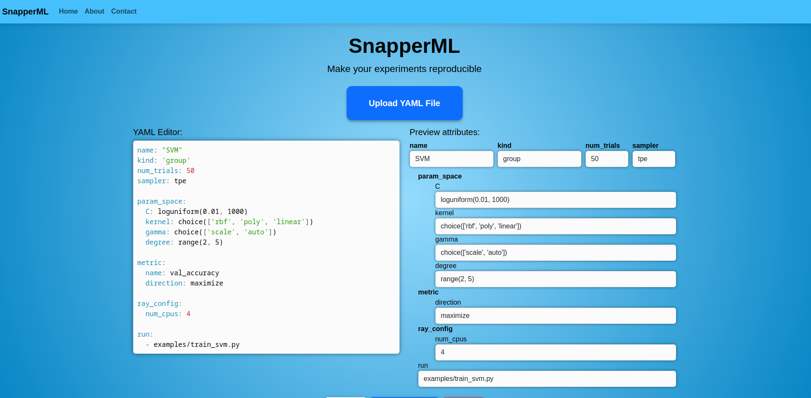
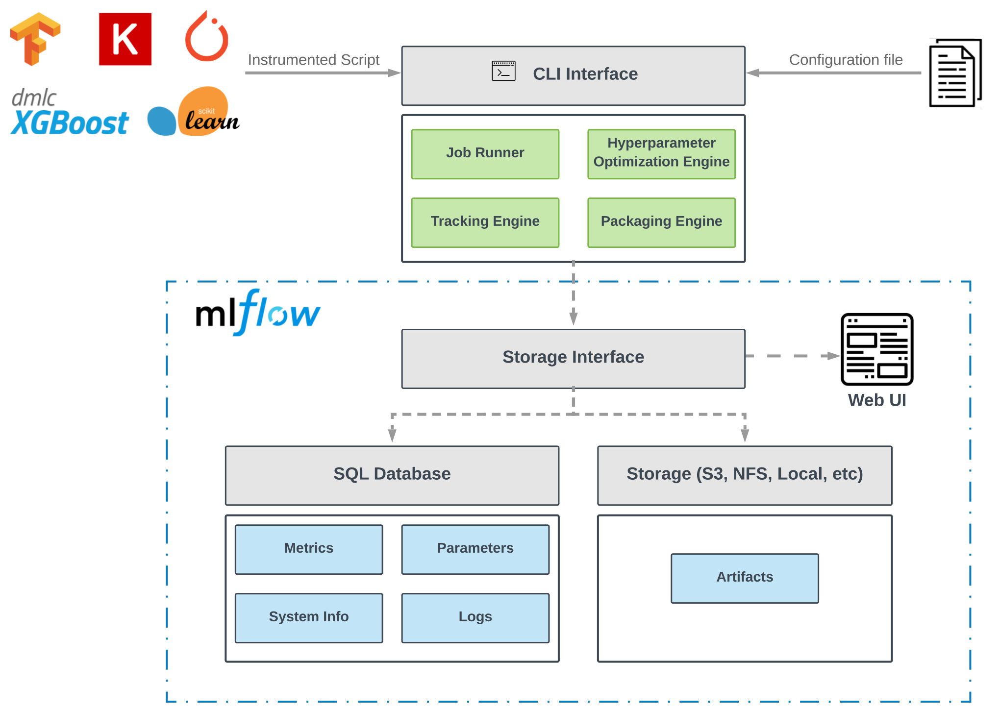

# SnapperML

[](https://snapperml.readthedocs.io/en/latest/?badge=latest)

<div style="text-align: center;">
  
</div>

SnapperML is a framework for experiment tracking and machine learning operationalization that combines existent and well-supported technologies. These technologies include Docker, [Mlflow](https://mlflow.org/), [Ray](https://github.com/ray-project/ray/), among others.

The framework provides an opinionated workflow to design and execute experiments either on a local environment or the cloud. ml-experiment includes:

- An automatic tracking system
- First-class support for distributed training and hyperparameter optimization
- Command Line Interface (CLI) for packaging and running projects inside containers.

## SnapperML UI

To run snapper UI execute:

```
make UI
```

Open [localhost:4000](http://localhost:4000/) and upload your firsts experiments!



To stop snapper UI just execute:

```
make stop_UI
```

## How to install?

The project has some core dependencies:

- mlflow
- optuna>=1.1.0
- ray>=0.8.2
- docker>=4.1.0

The python package can be install using **pip**:

```
pip install snapper-ml
```

Or from this repo:

```
pip install -e .
```

## Deploy

To run snapper first you need to deploy mlflow and optuna. Execute:

```
make docker
```

Once the deploy finished you can execute `snapper-ml` in the CLI. For an ilustrative example, check the [example section](#Example).

## Architecture

The framework main core is divided into four modules that interact with the user through a Command-Line Interface (CLI) and a Python library.
The objective of the library is to minimize the code changes required to instrument scripts to be executed by the Job Runner and to provide the abstractions to interact with the Tracking and Hyperparameter Optimization engines. On the other hand, the CLI is in charge of executing scripts either in a local
environment or a remote environment.



## Documentation

The documentation is available [here](https://snapperml.readthedocs.io/en/latest/)

## Example

```python
# train_svm.py

from snapper_ml import job

@job
def main(C, kernel, gamma='scale'):
    np.random.seed(1234)
    X_train, X_val, y_train, y_val = load_data()
    model = SVC(C=C, gamma=gamma, kernel=kernel)
    model.fit(X_train, y_train)
    accuracy = model.score(X_val, y_val)
    return {'val_accuracy': accuracy}


if __name__ == '__main__':
    main()
```

```yaml
# train_svm.yaml

name: "SVM"
kind: "group"
num_trials: 12
sampler: TPE

param_space:
  C: loguniform(0.01, 1000)
  gamma: choice(['scale', 'auto'])

metric:
  name: val_accuracy
  direction: maximize

ray_config:
  num_cpus: 4

run:
  - train_svm.py
```

```bash

snapper-ml --config_file=train_svm.yaml
```

There are more examples in the [examples folder](https://github.com/yerasiito/SnapperML/tree/master/examples).
