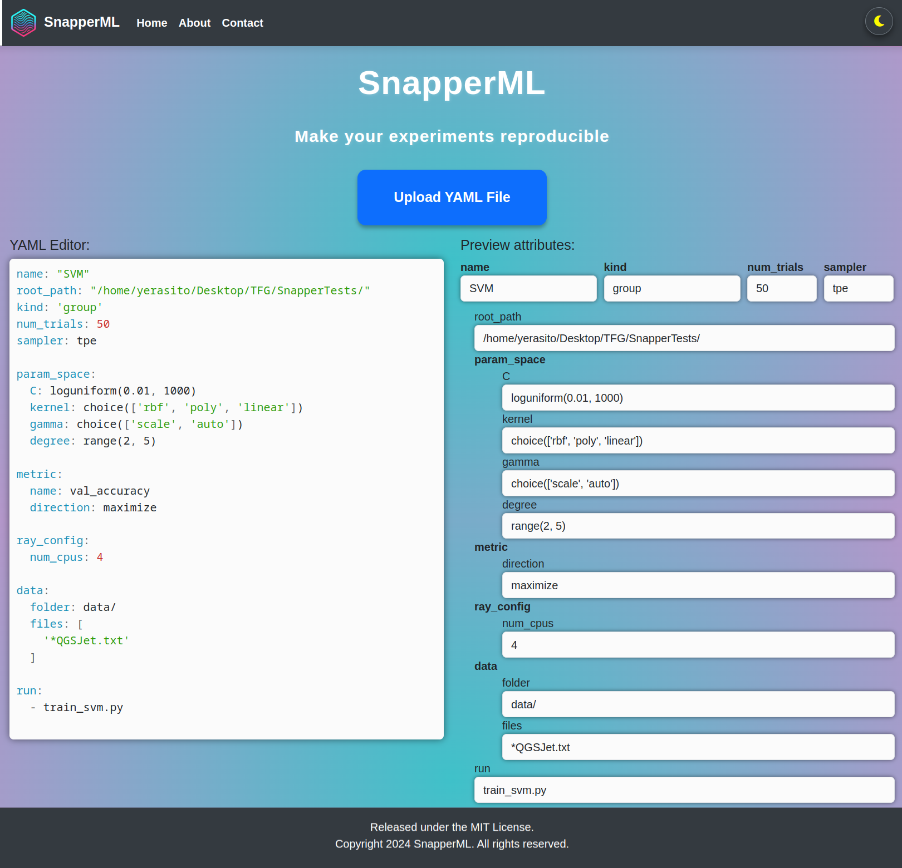
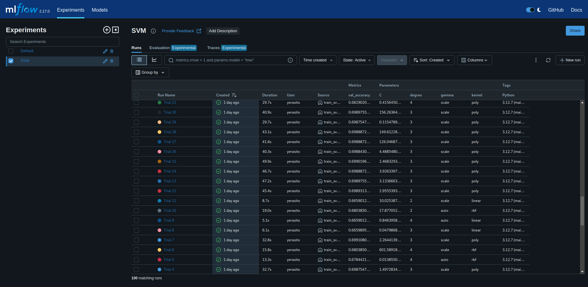

# SnapperML UI

Make your experiments easily reproducible with SnapperML UI

Interact with snapper using the interactive terminal

And check your experiments stats in mlflow!

Extra logs, stored config files and more in the local `artifacts` folder.

## Deploy UI

Deploy the UI executing `snapper-ml make UI`.

And stop it with `snapper-ml make stop_UI`.
